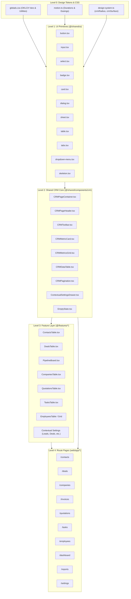

# CRM Design System Audit — Component Dependency Map

> **Audit Date:** September 2026  
> **Repository:** `clixprocrm`  
> **Purpose:** Trace architectural dependencies from Design Tokens down to Feature Screens and identify isolated or copied components.

---

## 1. High-Level Dependency Graph



---

## 2. Detailed Component Dependency Trees

### 2.1 Contacts Flow
```
Token: --primary, --crm-radius-card, motionTokens.easing
  └── Primitive: Button, Input, Sheet, Badge
        └── CRM Core: CRMPageContainer, CRMPageHeader, CRMToolbar, CRMMetricCard, ContextualSettingsDrawer
              └── Feature: ContactsTable, BulkImportModal, ContactContextualSettings, LeadForm, CustomerForm
                    └── Page: web/app/(dashboard)/contacts/page.tsx
```

### 2.2 Deals & Pipeline Flow
```
Token: --crm-card-shadow, --shadow-elevated, kanban-board-scroll
  └── Primitive: Button, Dialog, DropdownMenu, Tabs
        └── CRM Core: CRMPageContainer, CRMPageHeader, CRMToolbar, CRMMetricCard, ViewToggle
              └── Feature: DealsTable, DealsGrid, PipelineBoard, DealContextualSettings, DealForm
                    └── Page: web/app/(dashboard)/deals/page.tsx
```

### 2.3 Invoices Flow
```
Token: --primary, --border, --shadow-card
  └── Primitive: Button, DropdownMenu, Sheet, TruncatedText
        └── CRM Core: CRMPageContainer, CRMPageHeader, CRMToolbar, CRMMetricCard
              └── Feature: CreateInvoiceModal, InvoiceDetailModal, RecordPaymentModal, InvoiceContextualSettings
                    └── Page: web/app/(dashboard)/invoices/page.tsx (Note: uses raw <table> markup instead of CRMDataTable)
```

### 2.4 Settings Flow
```
Token: --font-sans, --sidebar-border, motionTokens.duration
  └── Primitive: Button, Input, Switch, Tabs, Avatar, Dialog
        └── CRM Core: CRMPageContainer, SettingsHeader
              └── Feature: ProfileSettings, NotificationsSettings, WorkspaceSettings, SubscriptionSettings, SecuritySettings, SessionsSettings, AuditLogSettings
                    └── Page: web/app/(dashboard)/settings/page.tsx
```

---

## 3. Disconnected / Copied Components (Orphans & Local Overrides)

1. **`web/shared/components/crm/CRMSearchBar.tsx`**: Fully implemented but bypassed by all CRM pages in favor of the inline search field inside `<CRMToolbar />`.
2. **`web/features/leads/components/LeadEmptyState.tsx`**: Copied local empty state implementation with custom artwork, disconnected from the central `<EmptyState module="leads" />`.
3. **`web/features/calendar/components/EmptyState.tsx`**: Local card empty state disconnected from `@/shared/components/EmptyState`.
4. **`web/app/(dashboard)/invoices/page.tsx` table block**: Implements a manual table markup rather than reusing `<CRMDataTable />` or `<DataTable />`.
